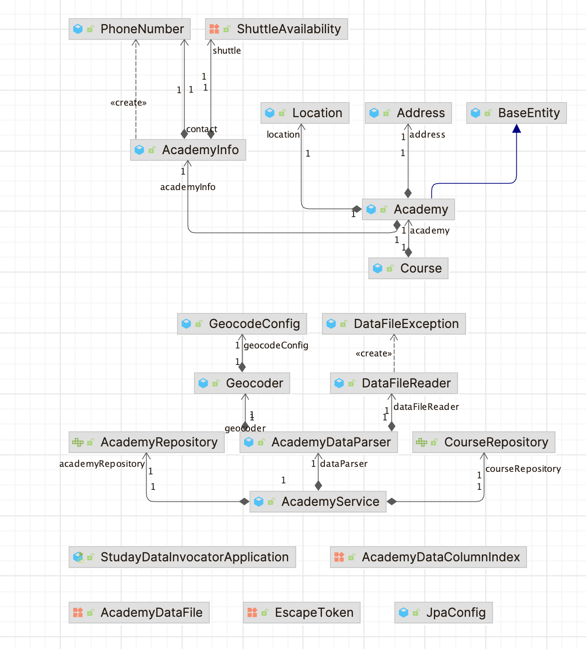

# ⛩️ 스터데이 데이터 인보케이터

## 🎯 목적

- 학원 공공데이터에서 `원하는 데이터만 추출`하여 서버에 저장
    - 경기, 서울 학원 현황 공공데이터 (CSV 파일) 파싱
- 이점
    - 스터데이 원 `서버 과부하 방지`
    - 서버 별 `역할 분리`

## 링크

- 블로그
    - [⛩️ 스터데이 데이터 인보케이터](https://velog.io/@onetuks/스터데이-데이터-인보케이터)

- Github
    - https://github.com/Guzzing/Data_Invocator.git

## 📚 기술스택

- Java 17
- Spring 6
- Spring Boot 3.1.5
- Docker
- MySQL 8
- Library
    - Spring Data JPA
    - Lombok
    - WebFlux
    - Gson

## 🏛️ 구조

`DataFileReader`

- 데이터 파일 (CSV) 파일 읽기
- `AcademyDataParser`
    - 원하는 데이터 컬럼 추출
    - 주소 정보로 위경도 정보 변환
    - 데이터를 학원 정보 + 수업 정보로 분리
- `Geocoder`
    - 네이버 지오코드 활용 (외부 API 호출)
        - V1: RestTemplate 방식 구현
        - V2: WebClient 방식 구현
            - WebFlux 라이브러리 활용
        - Json 응답을 Map 으로 변환
            - Gson 라이브러리 활용
    - 공공데이터 주소값 → 위경도 변환

## 🦽 사용법

1. 아래 공공데이터 링크에서 엑셀 파일을 다운로드 받는다.
2. 해당 엑셀 파일을 `CSV 파일`로 내보내기 한다.
    1. CSV `구분자`는 쉼표(,), 공백을 제외한 문자로 설정한다.
    2. 슬래시(/) 권장
3. 프로젝트 루트에 있는 `docs/data` 폴더에 CSV 파일을 이동시킨다.
4. `StudayDataInvocatorApplicationTests` 테스트를 실행한다.
5. DB 내용을 확인한다.

## 🫵 주요 기능

### 주소 정규화

- `경기도 성남시 중랑구 서구로6번길 4 / 3층 일부 (하서원동)`
- 위 주소를 검색 필터에 필요한 컬럼 3개와 원본 주소로 분리
    - full_address : `경기도 성남시 중랑구 서구로6번길 4 / 3층 일부 (하서원동)`
    - sido : `경기도`
    - sigungu : `성남시`
    - address : `중랑구`

### 주소 위경도 변환

- `경기도 성남시 중랑구 서구로6번길 4 / 3층 일부 (하서원동)`
- 위 주로를 네이버 Geocode 서비스 활용해 위경도로 변환
- 중복된 주소인 경우 호출 횟수 감소로 비용 절감 위해 캐싱 적용
    - 호출 직전 Java Map 자료구조 활용해 `in-memory 캐싱` 적용

### 데이터 파일 파싱

- CSV 파일을 대상으로 문자열 파싱
    - 공공데이터 제공 파일 형식이 엑셀 파일이기 때문에 CSV 파일로 처리 대상 정함
- 공공데이터 컬럼 확장성 고려
    - 공공데이터에서 제공하는 모든 컬럼을 enum 항목으로 만들어 필요 데이터 사양 변경 시 유연한 변경 지향

### 파싱 데이터 DB 저장

- Spring Boot JPA 활용
    - JDBC 직접 활용, MyBatis 보다 개발 비용이 좋다고 판단해 사용
- Academy 엔티티 + Course 엔티티 분리
    - 테이블 크기 감소
    - 데이터 정규화
    - 쿼리 최적화

## 🤖 시도점

- 캐싱
    - `데이터 특성 고려`
        - 같은 주소가 모여있는 클러스터링 특성 고려
        - 한 번 구한 주소는 다음 데이터에서도 활용될 가능성이 높음
        - 추후 배치 처리할 때 배치 묶음에서 캐싱 효용 기대 가능
    - `서비스 특성 고려`
        - 모든 데이터를 네이버 API 를 활용해 요청하기엔 비용 문제 심각
        - API 호출을 최대한 억제해야 할 필요성
    - `인 메모리 방식 고려`
        - DB 캐싱 방식은 추후 배치 처리에서 캐싱 효용이 낮아질 것
        - 인 메모리 방식으로 배치 처리 내에서 캐싱 효용을 확보하는 것이 더 큰 이점 있을 것
- 외부 API 호출
    - RestTemplate 방식
        - 이전에 Java 진영에서 자주 활용되던 방식
        - 쉬운 사용법으로 간단하게 주소 → 위경도 변환 결과 확인하는 용도로 구현
        - 동기/비동기 방식을 선택할 수 없이 동기 방식이기에 WebClient 방식 추가 구현
    - WebClient
        - WebFlux 라이브러리 활용해 구현 가능
        - 이점
            - 동기/비동기 선택 가능
            - 높은 처리량, 확장성
            - 리액티브 프로그래밍 가능
        - 단점
            - webflux 학습 필요
    - 데이터 파싱 작업 내에서 외부 API 호출이 필요했으므로, `동기 방식(block)`으로 구현
- 데이터 구분자
    - 제공 데이터 형식이 엑셀 고정이라 문자열 처리를 편하게 하기 위해 CSV 파일로 데이터 파일 형식 고정
        - 데이터 내부에 CSV 기본 구분자 (쉼표: ,) 가 존재했기 때문에 파싱 어려움 존재
        - 이를 극복하고자 쉼표가 아닌 다른 구분자 (/) 로 설정하는 방식 도입
    - OpenAPI 활용하는 방식이었으면 스케줄러와 배치 처리를 통해서 완전 자동화가 가능했을텐데, 해당 데이터 활용을 위해서는 데이터 업데이트 마다 수동으로 데이터 처리를
      해줘야 한다는 것이 단점임

## 🔗 공공데이터

[경기도교육청_경기도 학원 정보_20230701](https://www.data.go.kr/data/3044325/fileData.do)

[서울시 학원 교습소정보](http://data.seoul.go.kr/dataList/OA-20528/S/1/datasetView.do)